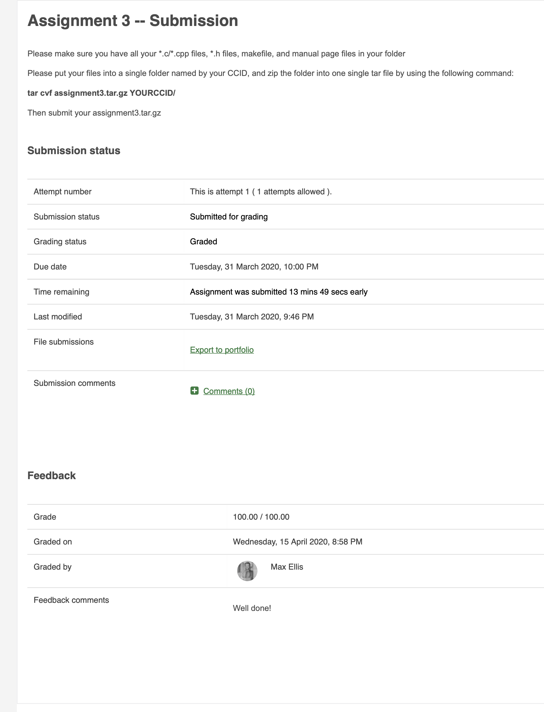

# CMPUT379-Assign3

How to run (Linux Ubuntu):
  1. Find the IPv4 address of the device.
  2. In a terminal, enter the directory of this repository. 
  3. Enter "make".
  4. type "./server port_number" where port_number is a number between 5000 and 64000 (inclusive).
  5. Open another terminal and proceed to step 5.1 for file input redirection, or step 5.2 for user input.  
    5.1. Enter "./client port_number ipv4_address <input.txt" where port_number is the same as the one entered for server, ipv4_address is the IPv4 address of the device, and input.txt is a text file with the transaction items. There is a 60 second inactivity timeout period for the server.  
    5.2. Enter "./client port_number ipv4_address" where port_number is the same as the one entered for server and ipv4_address is the IPv4 address of the device. Valid inputs are "T_integer" and "S_integer," where T_integer is the letter T attached by a positive integer (0 inclusive) (Eg. T100, T13) and S_integer is the letter S attached by a positive integer (0 inclusive) (Eg. S3133, S2). T_integer is a standard transaction, whereas S_integer puts the system to sleep for integer amount of time. There is a 60 second inactivity timeout period for the server.  
    5.3. Multiple clients can be running. Each client has exclusive access to the server until termination of that client. Clients are ordered in sequential order, and the next client will gain access when the client before it terminates.  
    5.4. To terminate a client, enter a non-valid input or terminate the program.
  6. If successful, the server will output each transaction to the terminal. It will stay active as long as at least one client is still connected. If no clients are connected, the server will terminate after the 60 second inactivity timeout period. Upon termination the server will output a summary.
  7. All transactions for the server session are logged in a log file.
  8. To remove all log files created and executables, enter "make clean".

I recieved a mark 100/100 on this assignment as seen in the PDF in this repository.

